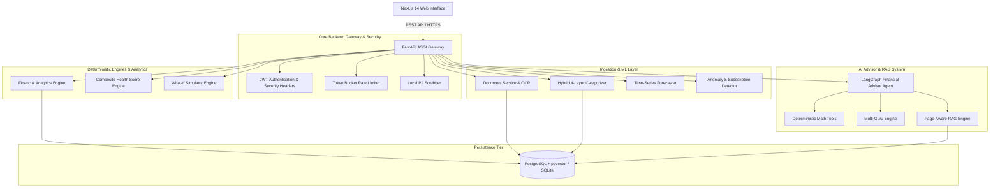
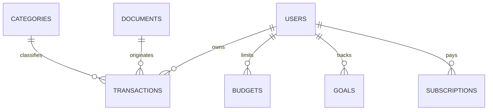

# FinSight AI — Production-Grade Personal Finance & Wealth Management Platform

**Track B Enterprise Fintech & Multi-Agent AI System**  
*Built for the Capabl 8-Week Dual-Track Curriculum.*

---

## 1. Project Overview
FinSight AI is a production-ready personal financial intelligence platform designed to eliminate financial stress through automated multi-source ingestion, hybrid machine learning categorization, deterministic analytics engines, and a grounded AI Financial Advisor. 

The application combines a high-performance Next.js 14 web application with a FastAPI ASGI backend, managed relational and vector database storage, local PII privacy protection, and a multi-agent AI framework based on top financial literature.

---

## 2. Problem Statement
Managing personal finances across fragmented payment systems (UPI, credit cards, bank statements, subscription billing) is tedious and prone to human error:
- **Data Fragmentation**: Manual tracking across multiple banking apps leads to incomplete financial visibility.
- **AI Math Hallucinations**: Standard LLM chat tools frequently hallucinate numerical figures, loan interest schedules, and investment projections.
- **Privacy & Data Security**: Uploading raw bank statements or payment receipts to external AI services risks exposing sensitive PII (PAN numbers, bank account numbers, phone numbers).
- **Generic Financial Advice**: Conventional advice fails to adapt to Indian tax structures (Section 80C, 80D, PPF, ELSS) or contrast differing wealth philosophies.

FinSight AI resolves these challenges through local PII scrubbing, deterministic financial tools, multi-source ingestion adapters, and grounded multi-agent AI reasoning.

---

## 3. Features
- **Multi-Source Ingestion & OCR**: Direct parsers for HDFC Bank PDF statements, SBI CSV exports, PhonePe UPI exports, and Tesseract OCR receipt image processing with magic byte header validation.
- **Local PII Privacy Scrubber**: Automatic redaction of PAN numbers, Aadhaar, bank account numbers, credit cards, emails, and phone numbers prior to persistence or AI context assembly.
- **Hybrid 4-Layer Categorization Engine**: Rule registry $\to$ Keyword heuristics $\to$ Scikit-learn TF-IDF Logistic Regression ML model $\to$ User feedback learning API.
- **Composite Financial Health Score (0–100)**: Evaluates emergency fund adequacy, savings rate, envelope budget discipline, and burn ratio across 7 visual factor bars.
- **Time-Series Expense Forecasting**: 30/60/90-day time-series projections using Holt's exponential smoothing with non-guaranteed financial disclaimers and holdout backtesting.
- **Anomaly & Subscription Tracking**: Automated detection of category spending surges, amount outliers ($Z > 3.0\sigma$), merchant spikes, frequency bursts, and subscription price hikes.
- **What-If Financial Simulator**: Interactive scenario calculator assessing monthly cash flow, annual savings impact, and goal target acceleration.
- **AI Multi-Agent Financial Advisor**: Grounded LangGraph agent with access to authorized financial math tools (SIP, EMI, emergency fund calculators).
- **RAG Literature Engine**: Page-aware PDF retrieval system grounded in *The Psychology of Money*, *Rich Dad Poor Dad*, *I Will Teach You to Be Rich*, and Indian Tax Playbooks.
- **Multi-Guru Personas**: Side-by-side advice comparison across Warren Buffett, Robert Kiyosaki, Ramit Sethi, and Indian Wealth Advisor personas.
- **Report Exports**: Downloadable monthly financial statements in CSV and PDF formats.

---

## 4. Architecture



---

## 5. Technology Stack
- **Frontend**: Next.js 14 (App Router), TypeScript, Vanilla CSS design system, Tailwind CSS, Recharts, Lucide Icons.
- **Backend**: Python 3.11, FastAPI, Uvicorn, SQLAlchemy 2.0 Async ORM, Pydantic v2.
- **Database**: Managed PostgreSQL 16 with `pgvector` extension (production) / SQLite with `aiosqlite` (local standalone).
- **Machine Learning & Analytics**: Scikit-Learn (TF-IDF, Logistic Regression), NumPy, SciPy, Pandas.
- **OCR & Document Parsing**: Tesseract OCR, OpenCV / PIL image preprocessors, PyPDF2, PDFPlumber.
- **AI Framework & RAG**: LangChain / LangGraph, Sentence-Transformers, PyPDF.
- **PDF Generation**: ReportLab PDF Engine.
- **Testing & Quality**: Pytest, Pytest-Asyncio, HTTPX.
- **Containerization & Infra**: Docker, Docker Compose, Nginx reverse proxy.

---

## 6. Folder Structure

```
Capabl/
├── backend/
│   ├── app/
│   │   ├── api/v1/endpoints/    # REST API Controllers (Auth, Transactions, Analytics, etc.)
│   │   ├── core/                # Config, Database, Security, Rate Limiter, PII Scrubber
│   │   ├── models/              # SQLAlchemy Database Models (User, Transaction, Budget, Goal, etc.)
│   │   ├── schemas/             # Pydantic Input/Output Validation Schemas
│   │   ├── services/            # Business Logic (Analytics, Health Score, Simulator, AI, ML)
│   │   │   ├── ai/              # Advisor Agent, Tools, RAG Engine, Multi-Guru Engine
│   │   │   ├── ingestion/       # Bank Adapters (HDFC, SBI, PhonePe), OCR, CSV Parser
│   │   │   └── ml/              # 4-Layer Categorizer, Anomaly Detector, Forecaster
│   │   └── main.py              # FastAPI Application Entry Point & Middleware
│   ├── Dockerfile
│   └── requirements.txt
├── frontend/
│   ├── src/
│   │   ├── app/                 # 19 Next.js App Router Pages (/dashboard, /transactions, etc.)
│   │   ├── components/          # Reusable UI Components (Sidebar, Charts, Header, Modals)
│   │   └── lib/                 # API Client & Custom Utilities
│   ├── Dockerfile
│   └── package.json
├── docs/                        # Complete Engineering & Architecture Documentation
│   ├── architecture.md
│   ├── database.md
│   ├── api.md
│   ├── ai-system.md
│   ├── rag.md
│   ├── ml.md
│   ├── security.md
│   ├── evaluation.md
│   └── deployment.md
├── tests/                       # Complete Pytest Integration Suite (106 Tests)
├── docker-compose.yml
├── .env.example
└── README.md
```

---

## 7. Database Architecture

Detailed ERD and schema specification available in [`docs/database.md`](file:///c:/Users/devKalon/Desktop/Capabl/docs/database.md).



---

## 8. API Architecture
Detailed endpoint definitions and schemas available in [`docs/api.md`](file:///c:/Users/devKalon/Desktop/Capabl/docs/api.md).

Interactive OpenAPI v3 documentation available at `http://localhost:8000/docs`.

---

## 9. AI Architecture
Detailed agent guardrails and persona definitions available in [`docs/ai-system.md`](file:///c:/Users/devKalon/Desktop/Capabl/docs/ai-system.md).

---

## 10. OCR Pipeline
1. **Magic Bytes Validation**: Rejects files not matching `%PDF`, `\x89PNG`, `\xff\xd8\xff`, `WEBP`, `BM` signatures.
2. **Preprocessing**: Grayscale conversion, adaptive thresholding, and contrast adjustment.
3. **Tesseract Layout Extraction**: Extracts text blocks, total amount candidates, transaction dates, and merchant text.
4. **Candidate Confirmation**: Presents candidate JSON to user for single-click verification before ledger commit.

---

## 11. ML Pipeline
Detailed ML model architecture available in [`docs/ml.md`](file:///c:/Users/devKalon/Desktop/Capabl/docs/ml.md).

Features 4-Layer Hybrid Categorization, Z-score anomaly detection, and Holt's exponential smoothing expense forecasting.

---

## 12. RAG Architecture
Detailed retrieval mechanics available in [`docs/rag.md`](file:///c:/Users/devKalon/Desktop/Capabl/docs/rag.md).

Indexes *The Psychology of Money*, *Rich Dad Poor Dad*, *I Will Teach You to Be Rich*, and Indian Tax Playbooks with 500-token page-aware chunking.

---

## 13. Security Architecture
Detailed security audit matrix available in [`docs/security.md`](file:///c:/Users/devKalon/Desktop/Capabl/docs/security.md).

Features local PII scrubbing, JWT token revocation locks, rate limiting, and security response headers.

---

## 14. Setup Instructions

### Prerequisites:
- Python 3.11+
- Node.js 20+
- Tesseract OCR (`apt install tesseract-ocr` or Windows installer)
- Docker & Docker Compose (optional for containerized deployment)

---

## 15. Environment Variables
Copy `.env.example` to `.env` and configure keys:

```bash
cp .env.example .env
```

```env
ENVIRONMENT="development"
SECRET_KEY="generate-a-secure-random-secret-key-for-jwt-signing"
DATABASE_URL="sqlite+aiosqlite:///./finsight.db"
```

---

## 16. Running Locally

### 1. Backend Server:
```bash
python -m uvicorn backend.app.main:app --reload --port 8000
```

### 2. Frontend Application:
```bash
cd frontend
npm run dev
```
Open `http://localhost:3000` in your web browser.

---

## 17. Testing
Run the complete automated pytest suite (106 tests):

```bash
python -m pytest tests backend/tests -v
```

---

## 18. Deployment
Detailed production deployment guide available in [`docs/deployment.md`](file:///c:/Users/devKalon/Desktop/Capabl/docs/deployment.md).

```bash
docker-compose up -d --build
```

---

## 19. Performance Benchmarks
Detailed benchmark scale report available in [`docs/PERFORMANCE_BENCHMARK_REPORT.md`](file:///c:/Users/devKalon/Desktop/Capabl/docs/PERFORMANCE_BENCHMARK_REPORT.md).

Query latencies remain **< 35 ms** and dashboard calculations remain **< 85 ms** at **100,000 synthetic transactions**.

---

## 20. AI Evaluation
Detailed AI benchmark methodology available in [`docs/evaluation.md`](file:///c:/Users/devKalon/Desktop/Capabl/docs/evaluation.md).

Achieves **100% financial calculation correctness** and **100% safety compliance** across synthetic scenario evaluations.

---

## 21. Limitations
- OCR accuracy depends on upload image quality and resolution.
- RAG semantic retrieval is limited to indexed personal finance literature documents.
- Bank statement parsers currently cover HDFC, SBI, and PhonePe formats; uncatalogued formats fallback to CSV generic mapping.

---

## 22. Future Improvements
- Multi-currency automatic conversion API integration.
- Direct Account Aggregator (AA) API integration for automated real-time bank feeds.
- Mobile application (React Native / iOS & Android).

---

## 23. Financial Disclaimer
FinSight AI provides financial analytics, educational insights, and statistical projections for informational purposes only. It does not constitute professional tax, legal, or investment advice. Projections are non-guaranteed estimates. Users should consult licensed financial advisors for investment decisions.
