# FinSight AI — System Architecture & Design

## Overview
FinSight AI is built as a multi-tier, modular enterprise fintech platform. It isolates deterministic financial calculations, database transactions, machine learning analytics, and AI reasoning pipelines into distinct, decoupled services.

```mermaid
graph TD
    Client[Next.js 14 Frontend Web Application] -->|REST API / HTTPS| Gateway[FastAPI ASGI Gateway]
    
    subgraph "Core Backend Gateway & Security"
        Gateway --> Auth[JWT Authentication & RBAC]
        Gateway --> RateLimit[Token Bucket Rate Limiter]
        Gateway --> PIIScrubber[Local PII Scrubber & Redactor]
        Gateway --> SecHeaders[Security Response Headers]
    end

    subgraph "Deterministic Engines & Business Logic"
        Gateway --> FinEngine[Financial Analytics Engine]
        Gateway --> HealthEngine[Composite Health Score Engine]
        Gateway --> SimEngine[What-If Scenario Simulator]
        Gateway --> ReportEngine[Monthly Financial Report & PDF Engine]
    end

    subgraph "Document Ingestion & Indian Bank Adapters"
        Gateway --> DocService[Document Ingestion Service]
        DocService --> MagicBytes[Magic Byte MIME Validator]
        DocService --> OCR[Tesseract / Layout OCR Engine]
        DocService --> Adapters[HDFC / SBI / PhonePe Adapters]
    end

    subgraph "Machine Learning & Analytics Pipelines"
        Gateway --> MLClassifier[Hybrid 4-Layer Categorizer]
        Gateway --> AnomalyDetector[Z-Score & Frequency Burst Anomaly Detector]
        Gateway --> Forecaster[Time-Series Holts Exponential Forecaster]
        Gateway --> SubTracker[Subscription & Recurring Payment Detector]
    end

    subgraph "AI Multi-Agent Advisor & RAG System"
        Gateway --> Agent[LangGraph Financial Advisor Agent]
        Agent --> FinTools[Deterministic Financial Math Tools]
        Agent --> GuruEngine[Multi-Guru Philosophy Engine]
        Agent --> RAG[Page-Aware RAG Retrieval Engine]
    end

    subgraph "Data Storage Tier"
        FinEngine --> DB[(Managed PostgreSQL + pgvector / SQLite)]
        DocService --> DB
        MLClassifier --> DB
        RAG --> DB
    end
```

---

## Technical Component Breakdown

### 1. Presentation Tier (Next.js 14 App Router)
- **Framework**: Next.js 14 with TypeScript.
- **Styling**: Vanilla CSS custom tokens + Tailwind CSS with dark mode palette, smooth transitions, and glassmorphism.
- **Data Visualization**: Interactive Recharts components for cash flow trends, envelope budgets, category breakdowns, and goal progress.
- **Routing**: 19 pre-rendered static & dynamic routes (`/dashboard`, `/transactions`, `/upload`, `/analytics`, `/budgets`, `/goals`, `/insights`, `/advisor`, `/philosophies`, `/forecast`, `/subscriptions`, `/reports`, `/settings`, etc.).

### 2. API Gateway & Micro-Services Tier (FastAPI)
- **Framework**: FastAPI (Python 3.11) with Uvicorn ASGI server.
- **Data Mapper**: SQLAlchemy 2.0 Async ORM with connection pooling.
- **Validation**: Pydantic v2 data contracts.
- **Middleware**: Rate Limiting, CORS origin whitelisting, Security headers (`HSTS`, `CSP`, `X-Frame-Options`), and sanitized 500 error handlers.

### 3. Ingestion & Pre-processing Pipeline
- **Magic Bytes Validation**: Verifies binary signatures (`%PDF`, `\x89PNG`, `\xff\xd8\xff`, `RIFF...WEBP`, `BM`) prior to disk writes.
- **OCR Engine**: Image binarization, contrast adjustment, deskewing, and Tesseract OCR layout extraction.
- **Indian Bank Adapters**: Direct parsers for HDFC Bank PDF statements, SBI CSV exports, and PhonePe UPI export transactions.
- **Local PII Scrubber**: Scraps PAN numbers, Aadhaar, credit cards, bank accounts, emails, and phone numbers before database persistence or AI context assembly.

### 4. Machine Learning & Forecasting Infrastructure
- **Hybrid Categorizer**: 4-layer classifier (Layer 1: Exact User Rules $\to$ Layer 2: Keyword Heuristics $\to$ Layer 3: TF-IDF Logistic Regression ML $\to$ Layer 4: Low-confidence flag & user correction learning).
- **Anomaly Detection Engine**: Detects category spending surges, transaction z-score outliers ($> 3.0\sigma$), merchant spikes, frequency bursts, and subscription price hikes.
- **Time-Series Forecaster**: 30/60/90-day time-series forecasting with non-guaranteed financial disclaimers and holdout backtesting.

### 5. AI Advisor & RAG Pipeline
- **LangGraph Tool Agent**: Autonomous agent with access to authorized financial calculation tools.
- **Deterministic Math Guardrails**: All numerical figures originate strictly from Python calculation functions, completely avoiding LLM math hallucinations.
- **RAG Engine**: Page-aware PDF text chunking (500 tokens with 50-token overlap), TF-IDF / vector semantic indexing, and page-specific citations.
