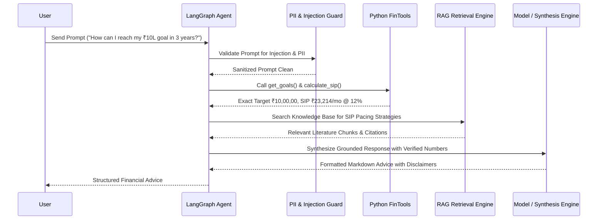

# FinSight AI — AI Advisor & Multi-Agent Architecture

## Design Principles
1. **Zero Math Hallucinations**: LLMs are prohibited from conducting arithmetic or database lookups directly. All numbers originate from deterministic Python tool calls.
2. **Strict Grounding**: System prompts enforce explicit acknowledgment when requested transaction ranges or merchant records are unavailable.
3. **Multi-Guru Comparison**: Advice perspectives are structured across Warren Buffett, Robert Kiyosaki, Ramit Sethi, and Indian Wealth Advisor.

---

## Controlled AI Tools Registry

- `get_transactions(db, user_id, limit, category, start_date, end_date)`: Authorized fetch of user transactions.
- `get_category_spending(db, user_id, month, year)`: Aggregated category spending summary.
- `get_budget_status(db, user_id)`: Category limit utilization and threshold warnings.
- `get_goals(db, user_id)`: Milestone target tracking and required monthly contributions.
- `calculate_sip(monthly_investment, annual_rate_pct, years)`: Deterministic SIP compound interest calculator.
- `calculate_emi(principal, annual_interest_rate, tenure_years)`: Loan EMI amortization calculator.
- `calculate_emergency_fund_target(monthly_expenses, target_months)`: Emergency reserve calculator.
- `search_financial_knowledge(query, top_k)`: RAG vector semantic search.

---

## Multi-Guru Personas Framework

- **Warren Buffett**: Focuses on intrinsic value, low-cost index funds, moat, long-term compounding, and avoiding debt.
- **Robert Kiyosaki**: Focuses on cash flow, assets vs. liabilities, real estate leverage, and passive income creation.
- **Ramit Sethi**: Focuses on conscious spending (spend ruthlessly on what you love, cut costs on what you don't), automating finances, and big wins.
- **Indian Wealth Advisor**: Focuses on PPF, ELSS tax savings (80C), NPS, digital gold, health insurance, and local Indian financial instruments.
