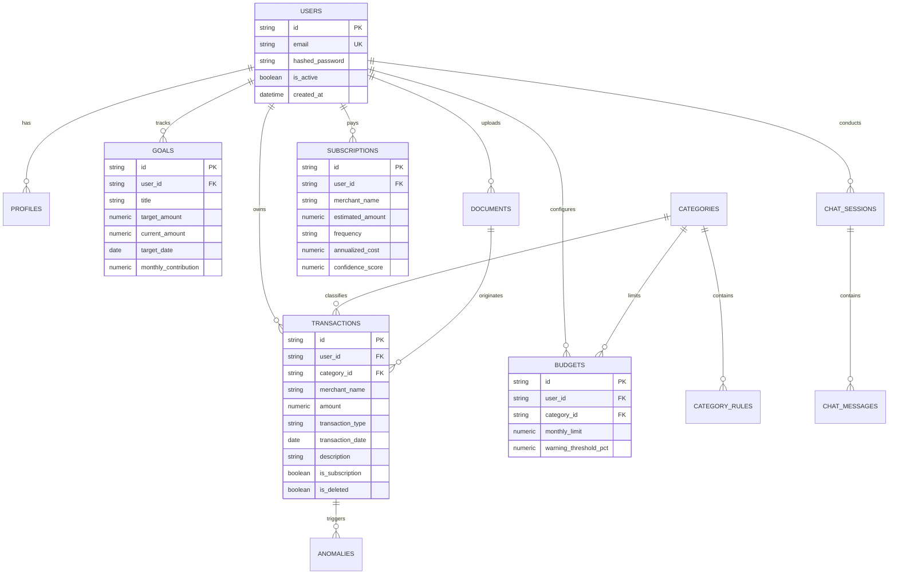

# FinSight AI — Database Architecture & Schema Specification

## Schema Design & ERD

FinSight AI utilizes a fully normalized Relational Database Schema supporting both Managed PostgreSQL (with `pgvector` extension for semantic search) and SQLite for standalone execution.

---

## Normalized Database Entities

### 1. `users`
- Primary Key: `id` (UUID string)
- Unique Index: `email`
- Security Fields: `hashed_password`, `is_active`, `is_superuser`

### 2. `profiles`
- Foreign Key: `user_id` $\to$ `users.id`
- Demographics & Financial Persona: `full_name`, `monthly_income`, `savings_target_pct`, `risk_tolerance`, `preferred_currency`

### 3. `transactions`
- Foreign Keys: `user_id`, `category_id`, `merchant_id`, `source_id`
- Indices:
  - `ix_transactions_user_date` (`user_id`, `transaction_date`)
  - `ix_transactions_user_active_date` (`user_id`, `is_deleted`, `transaction_date`)
  - `ix_transactions_user_active_type_date` (`user_id`, `is_deleted`, `transaction_type`, `transaction_date`)
- Financial Core: `amount` (Numeric 14,2), `transaction_type` ('debit'/'credit'), `payment_method` ('UPI'/'Credit Card'/'Debit Card'/'Net Banking'), `is_subscription`

### 4. `budgets`
- Foreign Keys: `user_id`, `category_id`
- Envelope Controls: `monthly_limit`, `warning_threshold_pct` (default 80.0%)

### 5. `goals`
- Foreign Key: `user_id`
- Milestone Calculations: `target_amount`, `current_amount`, `target_date`, `monthly_contribution` (SIP)

### 6. `subscriptions`
- Foreign Key: `user_id`
- Detection Parameters: `merchant_name`, `estimated_amount`, `frequency` ('monthly'/'annual'), `annualized_cost`, `confidence_score`

---

## Multi-Tenant Isolation Rules

1. Every operational database query explicitly filters on `user_id == current_user.id`.
2. Repositories enforce tenant boundary verification before executing updates or deletes.
3. Soft deletion (`is_deleted = True`) preserves audit trails while hiding records from UI views.
