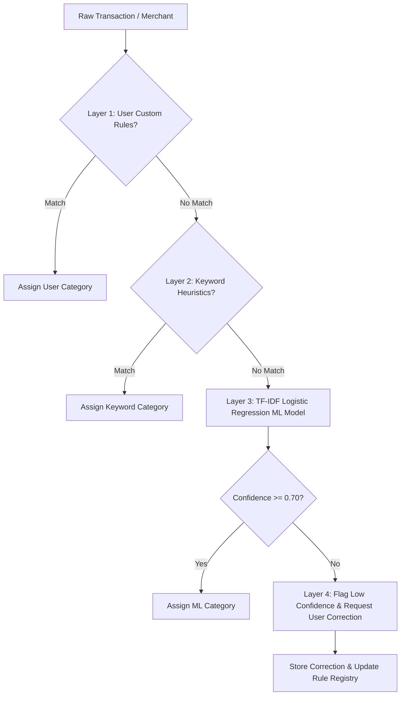

# FinSight AI — Machine Learning & Analytics Infrastructure

## 1. 4-Layer Hybrid Categorization Pipeline

FinSight AI employs a 4-layer fallback pipeline to achieve high categorization accuracy across Indian payment ecosystems (UPI, Net Banking, Cards, Screenshots):

### Layer Breakdown:
- **Layer 1 (User Rules)**: Highest priority exact match from user custom rule registry.
- **Layer 2 (Keyword Heuristics)**: Regular expression matching across 14 standard financial categories (`Food & Dining`, `Groceries`, `Shopping`, `Bills & Utilities`, `Transport`, `Healthcare`, `Entertainment`, `Travel`, `Investment`, `Salary`, etc.).
- **Layer 3 (TF-IDF Logistic Regression)**: Scikit-learn TF-IDF Vectorizer with Multinomial Logistic Regression trained on synthetic Indian transaction corpora.
- **Layer 4 (Correction Learning)**: Flagged low-confidence candidates (< 70% probability) presented to user for single-click confirmation, automatically learning new rules for future passes.

---

## 2. Anomaly Detection Engine

Detects spending anomalies across 5 criteria:
1. **Category Spending Surge**: Category expenditure > 150% of 3-month rolling average.
2. **Transaction Z-Score Outlier**: Transaction amount z-score $Z = \frac{x - \mu}{\sigma} > 3.0$.
3. **Merchant Surge**: Unexpected expenditure burst at a single merchant.
4. **Frequency Burst Spike**: Rapid succession of debits within a short time window.
5. **Subscription Price Hike**: Price increase detection on recurring subscriptions (> 10% change).

---

## 3. Time-Series Expense Forecasting

- **Model**: Holt's Exponential Smoothing & Moving Average time-series forecasting.
- **Horizon**: 30-day, 60-day, and 90-day forward projections.
- **Holdout Backtesting**: Evaluates Mean Absolute Percentage Error (MAPE) against historical holdout windows.
- **Non-Guaranteed Disclaimer**: Prominently displays financial disclaimers stating forecasts are statistical projections and not guaranteed financial returns.
