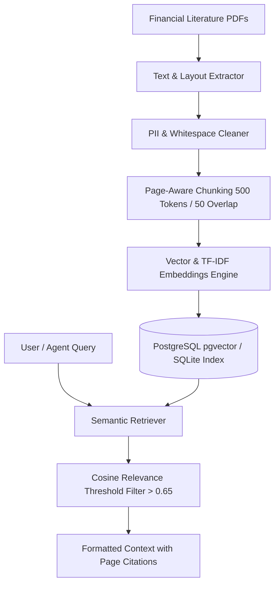

# FinSight AI — RAG Architecture & Literature Grounding

## Overview
FinSight AI implements a page-aware Retrieval-Augmented Generation (RAG) pipeline in [`backend/app/services/ai/rag_engine.py`](file:///c:/Users/devKalon/Desktop/Capabl/backend/app/services/ai/rag_engine.py). It indexes top personal finance literature to provide page-backed citations for AI recommendations.

---

## Indexed Literature

1. *The Psychology of Money* — Morgan Housel
2. *Rich Dad Poor Dad* — Robert Kiyosaki
3. *I Will Teach You to Be Rich* — Ramit Sethi
4. *Indian Tax & Financial Playbook* — Income Tax Rules, Section 80C, 80D, ELSS, PPF, NPS Guidelines

---

## Chunking & Retrieval Mechanics

- **Chunk Size**: 500 tokens with 50-token overlapping window to preserve context boundaries.
- **Page Metadata**: Every chunk stores source document title, author, chapter, page number, and chunk ID.
- **Cosine Relevance Threshold**: Queries returning similarity scores below 0.65 are discarded to prevent irrelevant context injection.
- **Citation Format**: `[Source: The Psychology of Money, Page 42]`.
